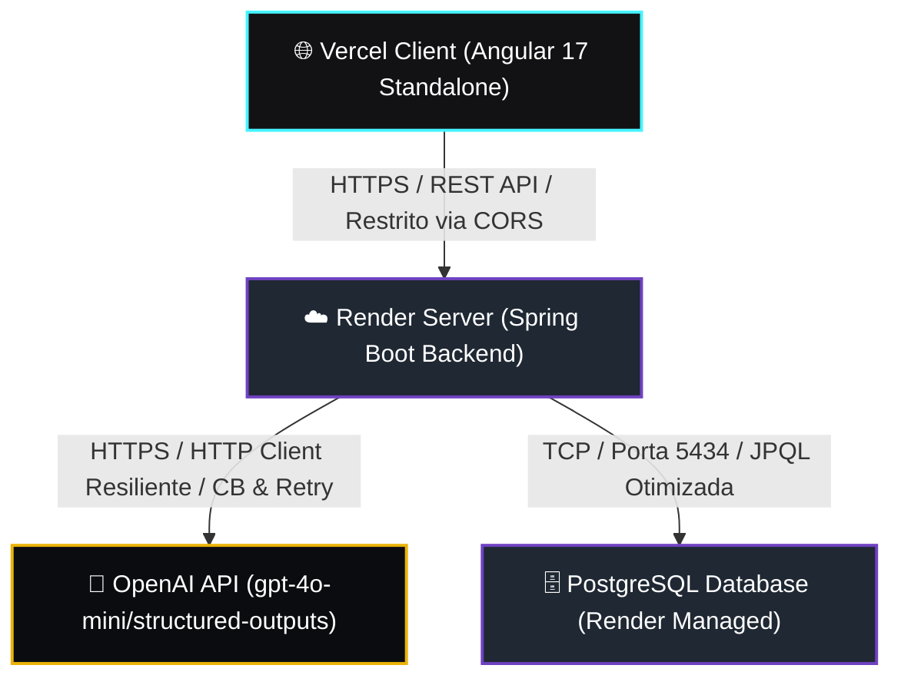

# PostMortem AI 🤖🛡️

[](https://github.com/joaogabriel43/PostMortem-AI)
[](https://github.com/joaogabriel43/PostMortem-AI)
[](LICENSE)

O **PostMortem AI** é uma plataforma inovadora baseada em SRE e Inteligência Artificial que automatiza o pipeline de análise de incidentes e gera relatórios de Post-Mortem profissionais a partir de logs brutos de produção (JSON, Plain Text e Stack Traces). O sistema adota rigorosamente os princípios da **Clean Architecture** (Arquitetura Hexagonal), resiliência em nuvem e segurança ativa.

---

## 🌐 Fluxo Arquitetural & Arquitetura de Rede

O diagrama abaixo detalha a topologia de rede e o fluxo de tráfego de dados entre as camadas da plataforma, ilustrando o deploy híbrido na nuvem:



---

## ⚡ Desafios Técnicos Resolvidos & Engenharia Premium

### 1. Blindagem Contra SSRF e XSS (OWASP Bypass)
Para viabilizar a exportação transiente de PDFs estilizados a partir de marcações Markdown geradas por IA, evitamos sanitizações superficiais via Expressões Regulares (Regex). Em vez disso, utilizamos o parser robusto **Flexmark** configurado estritamente com `HtmlRenderer.SUPPRESS_HTML = true`. Isso garante a neutralização de qualquer payload malicioso contendo tags `<script>`, `<iframe>` ou `onload` injetado nos logs brutos ou gerado pela LLM antes de alimentar o motor de PDFs do **OpenPDF**.

### 2. Idempotência Core via Hash SHA-256
Evitamos o desperdício de chamadas e processamento duplo de IA protegendo o backend. Para cada entrada de logs brutos, geramos uma assinatura de integridade SHA-256 determinística. O pipeline faz uma consulta no banco de dados antes de invocar a OpenAI: se um Post-Mortem para aquele hash já existir, a plataforma realiza um short-circuit instantâneo e retorna o relatório já persistido.

### 3. Isolamento Hermético do Domínio (Clean Architecture)
Para impedir vazamentos de infraestrutura, os modelos de domínio puro `Incident` e `PostMortem` são simples Records Java imutáveis de domínio. Toda paginação de banco de dados (`PageQuery`, `PageResult`) foi desenhada do zero de forma agnóstica na camada de aplicação. Nenhum framework ou importação como `org.springframework.data` alcança o Core de Negócio. As persistências são desacopladas por meio de **Output Ports** implementadas na infraestrutura física com mappers bidirecionais.

### 4. Consultas Otimizadas por JPQL Projections
Na tela de listagem de histórico, criamos a JPQL `IncidentJpaRepository.findHistoryByProjectName` para rodar um `LEFT JOIN` ultra-eficiente em memória entre a tabela de incidentes e post-mortems. Usando uma projeção de interface (`ProjectHistoryProjection`), extraímos apenas as 5 colunas estritamente necessárias (`id`, `title`, `severity`, `status`, `createdAt`), prevenindo sobrecarga de rede e otimizando a latência.

---

## 🛠️ Tecnologias Utilizadas

### Backend (Spring Boot 3.2.x):
* **Java 21 LTS** e **Spring Boot 3.2**
* **Resilience4j** (Circuit Breaker e Retry configurados para resiliência no `OpenAIClient`)
* **Flexmark** (conversão segura de Markdown para HTML)
* **OpenPDF** (gerador de documentos binários PDF nativos)
* **Flyway Migration** (controle de versão evolutivo de banco)
* **Testcontainers & WireMock** (testes de integração isolados e resilientes de ponta a ponta)

### Frontend (Angular 17 Standalone):
* **Componentes Standalone** (ausência de `AppModule` para otimização de bundle)
* **Angular Signals** (gerenciamento de estado reativo e eficiente para toats e status)
* **HttpInterceptor** (captura inteligente e tratamento visual elegante de erros baseados na RFC 7807)
* **Glassmorphism CSS** (design premium moderno com micro-animações dinâmicas)

---

## 🚀 Como Executar Localmente

### Pré-requisitos
* Java 21+ instalado
* Node.js 18+ instalado
* Docker rodando localmente (necessário para os testes integrados com Testcontainers)

### Executando o Backend
1. Clone o repositório e navegue até a pasta raiz:
   ```bash
   git clone https://github.com/joaogabriel43/PostMortem-AI.git
   cd PostMortem-AI
   ```
2. Forneça as credenciais necessárias no arquivo `.env` (copie do `.env.example`):
   ```bash
   cp .env.example .env
   ```
3. Suba o banco de dados PostgreSQL via Docker Compose:
   ```bash
   docker-compose up -d
   ```
4. Execute a aplicação Spring Boot:
   ```bash
   ./mvnw spring-boot:run
   ```
5. Para rodar todos os 67 testes integrados (Testcontainers & WireMock):
   ```bash
   ./mvnw clean test
   ```

### Executando o Frontend Angular
1. Navegue até a pasta `frontend/`:
   ```bash
   cd frontend
   ```
2. Instale as dependências do npm:
   ```bash
   npm install
   ```
3. Inicie o servidor de desenvolvimento:
   ```bash
   npm start
   ```
4. Abra o navegador em [http://localhost:4200](http://localhost:4200).

---

## ☁️ Deploy em Nuvem (Placeholders)
* **Frontend SPA (Vercel):** `https://postmortem-ai.vercel.app` (exemplo)
* **Backend API (Render):** `https://postmortem-ai-backend.onrender.com` (exemplo)
